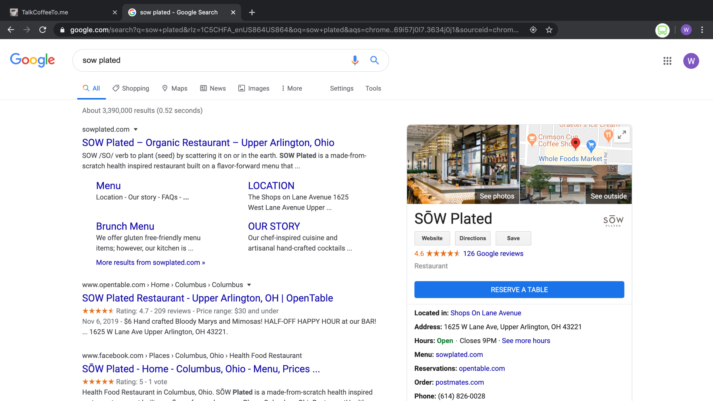
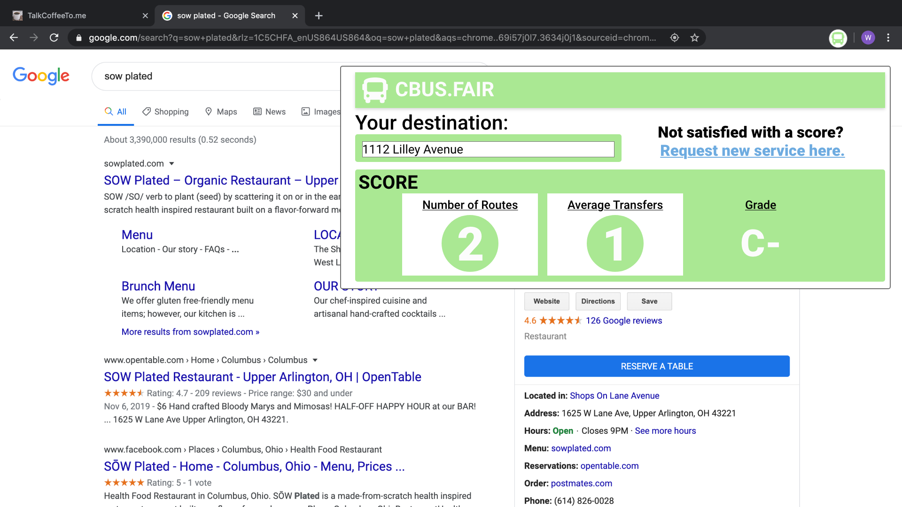
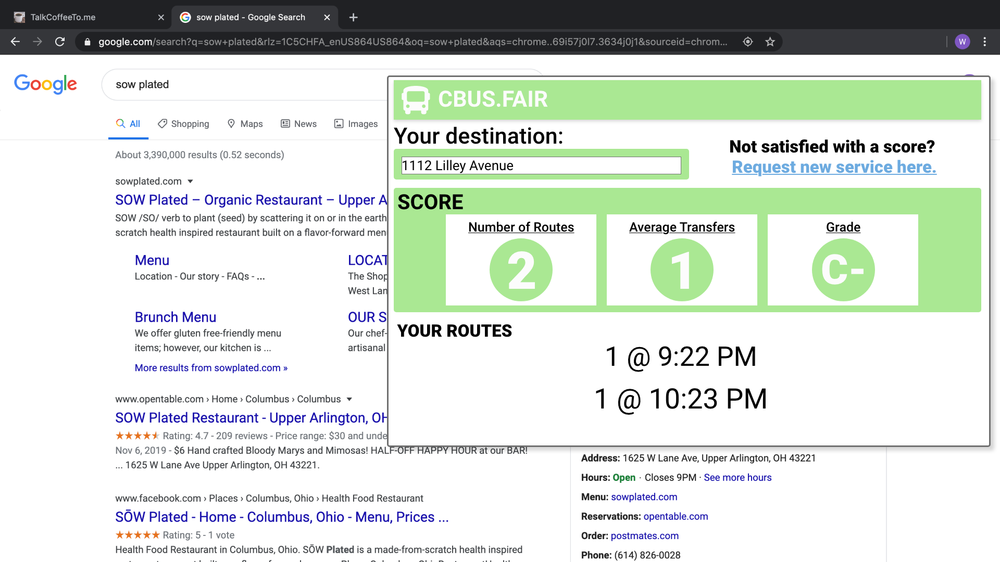
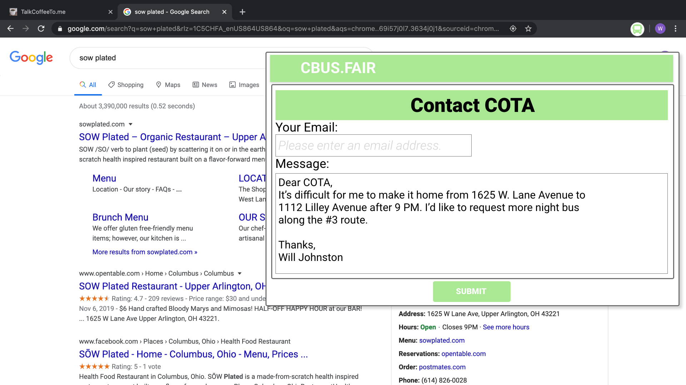

# cBUS 🚎 FAIR
**CODE OF CONDUCT**

Before getting into the spec, please review the [Code of Conduct](CODE_OF_CONDUCT.md). 

**WHAT IS IT?**
- A Chrome extension that rates bus route accessibility compared to a business's operating hours. 

**HOW IT WORKS**

1. A user seraches for a business on Google, for example, SŌW Plated, *a **really** delicious restaurant in Upper Arlington.*
   
   

    
   

2. Clicking the *Browser Action Icon* triggers a pop-up (`pop-up.html`) that uses data from the DOM + Google Transit API + a user profile to calculate an accessibility *score* for the business, based on the available public transportation options that exist **after normal business hours**.

    

      
    

3. For more information about after-business-hours routes, the user can click the *Number of Routes* button, revealing a list of route times.

    

      
    

4. Finally, the user can click the *Request New Services* link, to generate a form letter to COTA officials, pre-filled with all relevant information. 

    

      
    

**HOW TO USE IN DEVELOPMENT**
1. In Google Chrome, navigate to: `chrome://extensions` 
2. In the top right-hand corner of the *Extensions* window, toggle *Development mode* to '`On`'
3. In the top left-hand corner of the *Extensions* window, select `Load unpacked`
4. From your file browser, select the root directory for the project `\cbus_fair_chrome_extension`
5. You should now see the *Browser Action Icon* for the extension in your Extensions bar, located to the right of the Chrome Omnibox (address bar)   

**THINGS TO REMEMBER**
- Extensions are pretty straightforward combinations of HTML, CSS, and JavaScript. There are some unique things re: mandatory files, Chrome Runtime, Message Passing, and the event based nature of extensions. I recommend at least a passing familiarity with the [official Chrome Extensions documentation](https://developer.chrome.com/extensions/devguide).
- Chrome extensions do not support hot reload, so you need to manually refresh the extension between code changes. Its also a good idea to refreash your browser window between changes. 
- **Pop-up windows do not console to the regular dev tools window.** The console displayed there is from the DOM and is accessed via `content.js`. Pop-up window dev tools / console window can be access by right clicking an available pop-up and selecting *'`inspect`'*. A new dev window will be created for that instance of the pop-up. 
- Every Chrome extension has a mandatory '`manifest.json`' file. It acts as a combination of package.json and a config file, providing meta-data as well as permissions for the extension. 

